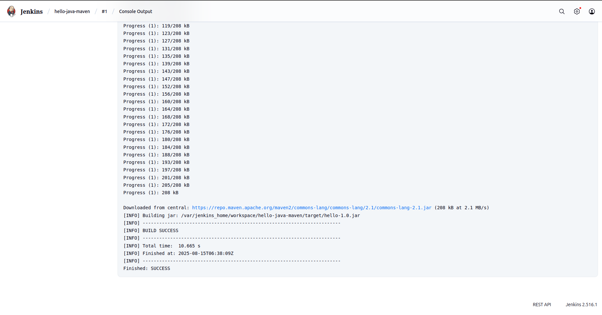

# Jenkins Maven Build Project

## What I Built

I created a simple Java application that prints "Hello, Jenkins + Maven!" and set up Jenkins to automatically build it using Maven. This was my first hands-on experience with CI/CD automation.

## Build Success Screenshot

*Screenshot of Jenkins console output showing BUILD SUCCESS:*



## Project Structure

```
hello-java-maven/
├── src/main/java/HelloWorld.java
├── pom.xml
└── README.md
```

## What I Learned

- How to create a basic Java Maven project
- How to configure Jenkins with Maven
- How to set up a Freestyle job in Jenkins
- How to integrate GitHub with Jenkins for automatic code pulling
- How CI/CD builds work in practice

## Setup Steps I Followed

1. **Created the Java App**: Simple HelloWorld class that prints a message
2. **Added Maven Configuration**: Created pom.xml with compiler plugin
3. **Started Jenkins**: Used Docker to run Jenkins locally on port 8080
4. **Configured Maven**: Added Maven 3.8.6 in Jenkins Global Tool Configuration
5. **Created Jenkins Job**: Set up Freestyle project with GitHub integration
6. **Connected to GitHub**: Configured Git source code management
7. **Ran the Build**: Executed `clean package` Maven goals

## Technologies Used

- **Java 8**: Programming language
- **Maven**: Build automation tool
- **Jenkins**: CI/CD platform
- **Docker**: To run Jenkins
- **GitHub**: Source code repository

## How to Run

1. Clone this repository
2. Start Jenkins with Docker: `docker run -p 8080:8080 jenkins/jenkins:lts`
3. Configure Maven in Jenkins
4. Create Freestyle job pointing to this GitHub repo
5. Build the project

The build should complete successfully and show "BUILD SUCCESS" in the console output.
